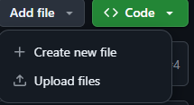

# 1. 기본 깃허브 주소에 접속한다
> https://github.com/HwanLee-0321/stock_price_prediction_model

* 그러면 다음과 같은 사이트가 뜬다


## [1]: 레파지스토리(프로젝트) 이름

## [2]: 현재 브랜치, 그리고 브랜치 종류들

* **이상한 가지모양** [main]: 현재 작업 브랜치(가지, 작업영역)이 main(주요) 레파지스토리이다!
    > 아마 작업하다 보면 main 브랜치가 아닌 각자의 역할에 맞는 브랜치에서 작업하게 될 것입니다!

* **이상한 가지모양** [5 branches]: 작업 브랜치들
    > 아하! 해당 프로젝트에서 전체 작업 브랜치가 총 5개구나!

- [주석] : 작업 브랜치 종류 및 설명

    - [main] 브랜치: `PM(이재환)`이 모든 브랜치에서 작업한 걸 모아서 최종 프로젝트로 저장하는 브랜치
        > 이재환을 제외하곤 **※절대 수정하거나, 건들지 말 것※**

    - [Financia_Market_Research]  브랜치: ```이후민```이 시장 조사를 해서 올려두는 작업 브랜치

    - [Data_Collection_and_Preprocessing] 브랜치: `김지호, 김태은` 이 데이터 수집 및 전처리를 해서 올려주는 브랜치

    - [Modeling] 브랜치: `고민서, 이재환` 이 모델링을 작업해서 올려두는 브랜치

    - [Report] 브랜치: `PM(이재환)` 이 필요시, 작업에 대해서 반려할 경우, 수정을 할 부분을 올려두는 브랜치

## [3]: 해당 브랜치가 가지고 있는 파일 목록

## [4]: README파일이라고 주로 해당 브랜치 및 프로젝트에서 뭘 하는지, 어떤 프로젝트인지 설명해주는 구간

# 2. 그 다음으로 \>\> **이상한 가지모양** [5 branches] <\<\ 를 클릭

> 위에를 정상적으로 수행할 시 다음과 같은 페이지가 뜸



