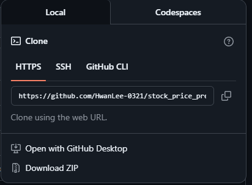
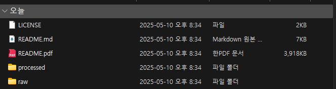
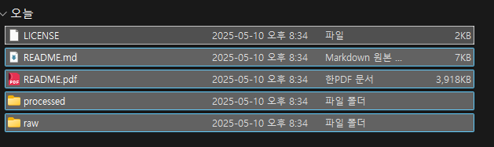
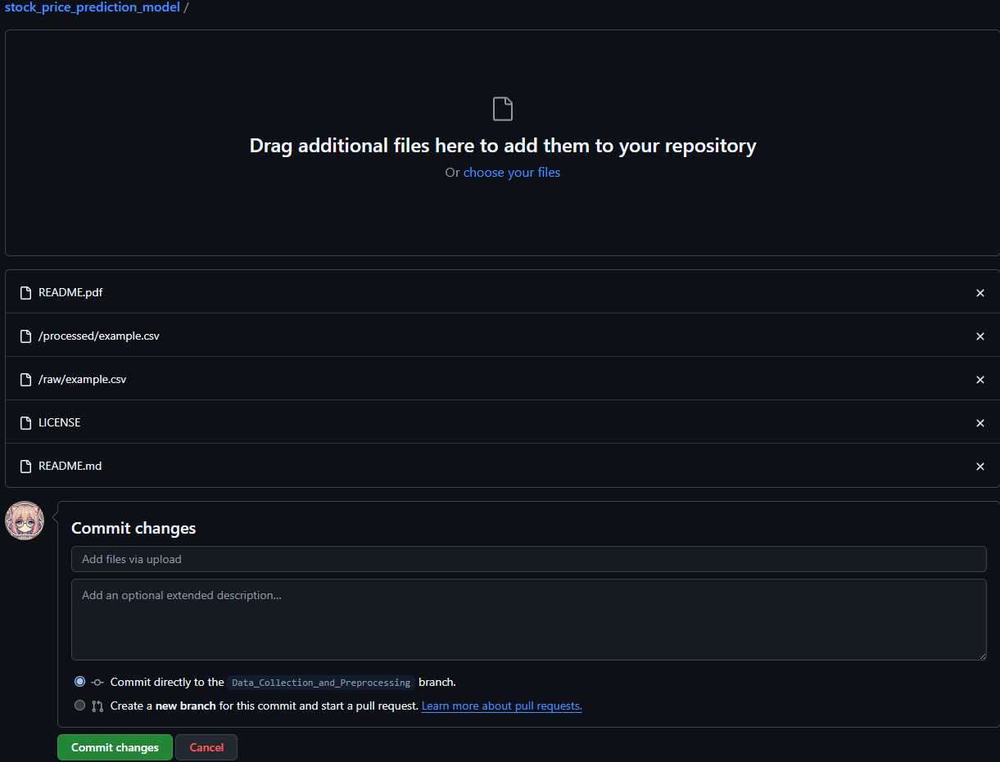

# 1. 기본 깃허브 주소에 접속한다
> https://github.com/HwanLee-0321/stock_price_prediction_model

* 그러면 다음과 같은 사이트가 뜬다


## [1]: 레파지스토리(프로젝트) 이름

## [2]: 현재 브랜치, 그리고 브랜치 종류들

* **이상한 가지모양** [main]: 현재 작업 브랜치(가지, 작업영역)이 main(주요) 레파지스토리이다!
    > 아마 작업하다 보면 main 브랜치가 아닌 각자의 역할에 맞는 브랜치에서 작업하게 될 것입니다!

* **이상한 가지모양** [5 branches]: 작업 브랜치들
    > 아하! 해당 프로젝트에서 전체 작업 브랜치가 총 5개구나!

## [3]: 해당 브랜치가 가지고 있는 파일 목록

## [4]: README파일이라고 주로 해당 브랜치 및 프로젝트에서 뭘 하는지, 어떤 프로젝트인지 설명해주는 구간

# 2. 그 다음으로 \>\> **이상한 가지모양** [5 branches] <\<\ 를 클릭

> 위에를 정상적으로 수행할 시 다음과 같은 페이지가 뜸


- [주석] : 작업 브랜치 종류 및 설명

    - [1] [main] 브랜치: `PM(이재환)`이 모든 브랜치에서 작업한 걸 모아서 최종 프로젝트로 저장하는 브랜치
        > 이재환을 제외하곤 **※절대 수정하거나, 건들지 말 것※**

    - [2] [Financia_Market_Research]  브랜치: ```이후민```이 시장 조사를 해서 올려두는 작업 브랜치

    - [3] [Data_Collection_and_Preprocessing] 브랜치: `김지호, 김태은` 이 데이터 수집 및 전처리를 해서 올려주는 브랜치

    - [4] [Modeling] 브랜치: `고민서, 이재환` 이 모델링을 작업해서 올려두는 브랜치

    - [5] [Report] 브랜치: `PM(이재환)` 이 필요시, 작업에 대해서 반려할 경우, 수정을 할 부분을 올려두는 브랜치

# 3. 각자의 브랜치에 가보자!

> 위에 사진 화면에서 자신이 해당하는 브랜치에 가보자!
방법은 쉽다! 자신의 브랜치 >>클릭!<<

> 일단 예시로 [Data_Collection_and_Preprocessing]에 가보았습니다!


* 빨간색 체크 박스 안이 현재 작업 브랜치인 [Data_Collection_and_Preprocessing]로 바뀐것을 확인할 수 있습니다!

* 이런 식으로 다들 자기 브랜치로 한번 이동해보세요!
    > 막히는 부분 있을 시 저한테 연락주세요.

# 4. 자신의 브랜치에 코드나, 파일을 업로드해보자!

* 아까 [Data_Collection_and_Preprocessing] 브랜치 기준으로 계속 설명하겠습니다.


* 새롭게 추가된 [Add file]을 클릭클릭!


* [Create new file] --> 새로운 파일을 만들기!

* [Upload file's'] --> 여러개의 파일들을 업로드 가능!

# 5. 업로드하고 편집하는 방식 추천해드리겠습니다

* 자기가 따로 더 공부해서 명령어로 멋지게 업로드 하든, 로컬용 Git 다운로드 받아서 휘양찬란하게 관리할 수도 있겠으나, 거의 대부분이 GitHub가 처음이실 테니, 아래와 같은 방법을 추천합니다!


* 사진 속 초록색 버튼인 `<> Code` 클릭!



* `Download ZIP` 클릭
    > 이후 다운로드 진행

* 다운로드 받은 파일 압축해제!
    [ex] `stock_price_prediction_model-Data_Collection_and_Preprocessing.zip` 압축해제



* 정상적으로 압축해제된 모습

* 이제 여기서 멋지게 파일들을 수정해주세요!!

* 그리고 개인이 수정만 하면 안되겠죠?
    > 수정한 프로젝트를 다시! Github에 올려주셔야 저를 포함한 다른 사람들이 확인할 수 있습니다!

    > 왜냐면 개인이 수정한 파일은 개인 컴퓨터에만 저장되어 있고, Github서버에는 없기 때문입니다!

# 6. 업로드를 해보자!

    > 다시 1번부터 차근차근히 자신의 브랜치에 가봅시다!

    > 똑똑한 세잎클로버 형누나들은 잘 자신의 브랜치에 왔을거라고 생각합니다!

다시 아래 버튼을 클릭


* [Upload files] 클릭!

* 자신의 모든 프로젝트를 Drag & Drop

[모든 프로젝트 폴더들을 선택한 모습]





* 그리고 맨 아래 초록버튼 [Commit changes] 클릭해주면! 축하합니다! 당신은 깃허브에 첫 발을 내 딛었습니다!